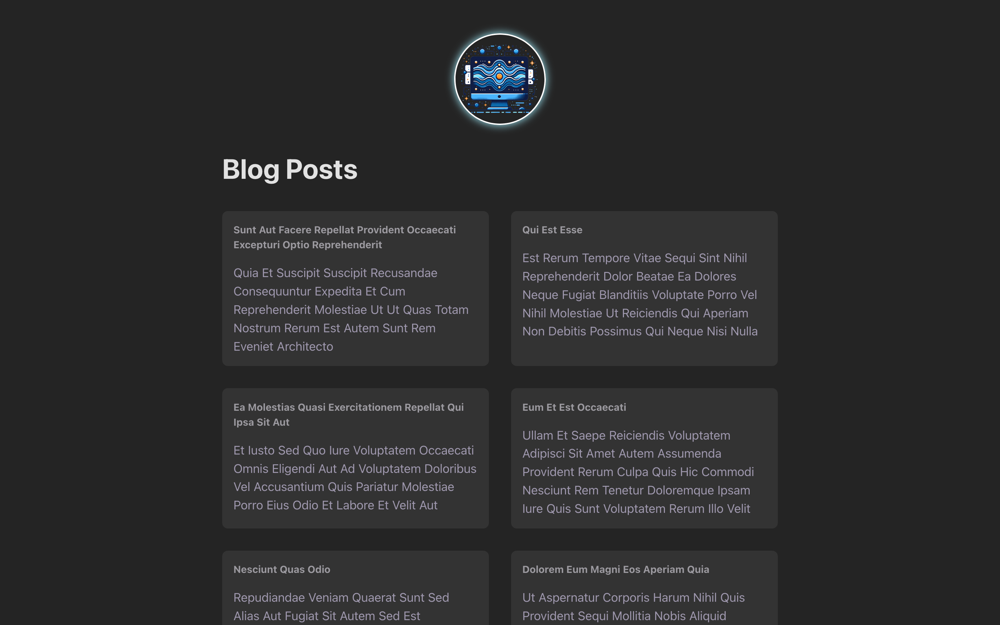
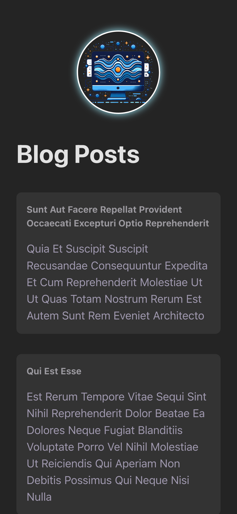

# Fetching Blog Posts

A clean, minimalist demo web application that fetches mock blog posts from [JSONPlaceholder API](https://jsonplaceholder.typicode.com/). Built with Vite, React, TypeScript, and CSS. Built to practice TypeScript and data fetching in React.



## Table of Contents

- [Fetching Blog Posts](#fetching-blog-posts)
  - [Table of Contents](#table-of-contents)
  - [Features](#features)
  - [Technologies Used](#technologies-used)
  - [Getting Started](#getting-started)
    - [Prerequisites](#prerequisites)
    - [Installation](#installation)
  - [Build for Production](#build-for-production)
  - [Future Enhancements](#future-enhancements)
  - [Contributing](#contributing)

## Features

- Fetch and display blog posts from [JSONPlaceholder API](https://jsonplaceholder.typicode.com/).
- Error handling and display if fetch is unsuccessful.
- Responsive design works on both desktop and mobile devices.



## Technologies Used

- [Vite](https://vitejs.dev/) - Next generation frontend tooling
- [React](https://reactjs.org/) - JavaScript library for building user interfaces
- [TypeScript](https://www.typescriptlang.org/) - Typed JavaScript for better developer experience
- [Fetch API](https://developer.mozilla.org/en-US/docs/Web/API/Fetch_API) - Provides an interface for fetching resources (including across the network)
- [JSONPlaceholder API](https://jsonplaceholder.typicode.com/) - Free fake and reliable API for testing and prototyping
- CSS - Custom styling with modern CSS techniques

## Getting Started

### Prerequisites

- Node.js (v14.0.0 or higher)
- npm or yarn

### Installation

1. Clone the repository

```bash
git clone https://github.com/yourusername/goal-tracker.git
cd goal-tracker
```

2. Install dependencies

```bash
npm install
# or
yarn
```

3. Start the development server

```bash
npm run dev
# or
yarn dev
```

4. Open your browser and navigate to `http://localhost:5173`

## Build for Production

```bash
npm run build
# or
yarn build
```

The build artifacts will be stored in the `dist/` directory.

## Future Enhancements

- Make POST requests to create/edit blog posts.

## Contributing

Contributions are welcome! Please feel free to submit a Pull Request.
